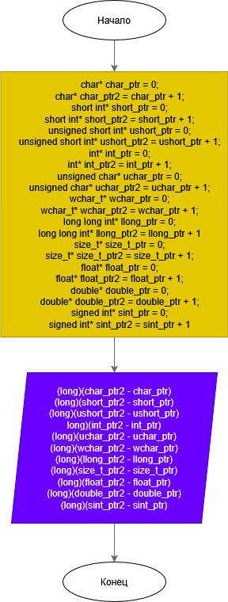
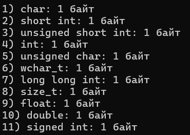

# Домашнее задание к работе 6

## Условие задачи
Написать программу, которая вычисляет размер основных типов данных в байтах без использования оператора sizeof и констант из заголовочных файлов limits.h и float.h.

## 1. Алгоритм и блок-схема

### Алгоритм
1. **Начало**
2. Для каждого типа данных создать два указателя
3. Инициализировать первый указатель нулевым адресом
4. Увеличить второй указатель на 1
5. Вычислить разницу между адресами в байтах
6. Вывести размер типа данных
7. **Конец**

### Блок-схема


https://github.com/DragonSov/lab12_homework/blob/master/schema.png

## 2. Реализация программы

```c
#include <stdio.h>
#include <locale.h>

int main() {
    setlocale(LC_CTYPE, "RUS");

    char* char_ptr = 0;
    char* char_ptr2 = char_ptr + 1;
    printf("1) char: %ld байт\n", (long)(char_ptr2 - char_ptr));

    short int* short_ptr = 0;
    short int* short_ptr2 = short_ptr + 1;
    printf("2) short int: %ld байт\n", (long)(short_ptr2 - short_ptr));

    unsigned short int* ushort_ptr = 0;
    unsigned short int* ushort_ptr2 = ushort_ptr + 1;
    printf("3) unsigned short int: %ld байт\n", (long)(ushort_ptr2 - ushort_ptr));

    int* int_ptr = 0;
    int* int_ptr2 = int_ptr + 1;
    printf("4) int: %ld байт\n", (long)(int_ptr2 - int_ptr));

    unsigned char* uchar_ptr = 0;
    unsigned char* uchar_ptr2 = uchar_ptr + 1;
    printf("5) unsigned char: %ld байт\n", (long)(uchar_ptr2 - uchar_ptr));

    wchar_t* wchar_ptr = 0;
    wchar_t* wchar_ptr2 = wchar_ptr + 1;
    printf("6) wchar_t: %ld байт\n", (long)(wchar_ptr2 - wchar_ptr));

    long long int* llong_ptr = 0;
    long long int* llong_ptr2 = llong_ptr + 1;
    printf("7) long long int: %ld байт\n", (long)(llong_ptr2 - llong_ptr));

    size_t* size_t_ptr = 0;
    size_t* size_t_ptr2 = size_t_ptr + 1;
    printf("8) size_t: %ld байт\n", (long)(size_t_ptr2 - size_t_ptr));

    float* float_ptr = 0;
    float* float_ptr2 = float_ptr + 1;
    printf("9) float: %ld байт\n", (long)(float_ptr2 - float_ptr));

    double* double_ptr = 0;
    double* double_ptr2 = double_ptr + 1;
    printf("10) double: %ld байт\n", (long)(double_ptr2 - double_ptr));

    signed int* sint_ptr = 0;
    signed int* sint_ptr2 = sint_ptr + 1;
    printf("11) signed int: %ld байт\n", (long)(sint_ptr2 - sint_ptr));

    return 0;
}
```

## 3. Результаты работы программы


## 4. Информация о разработчике
Попов Станислав, бИПТ-252
